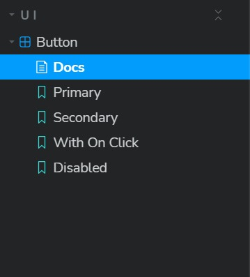
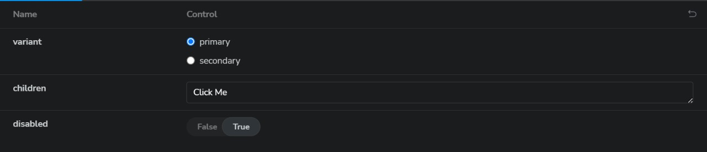
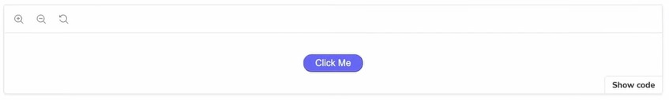
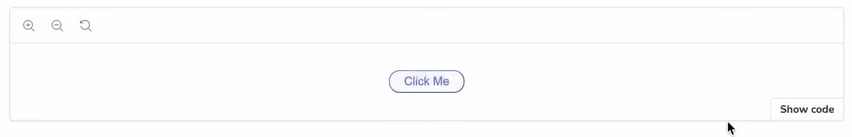

## **Button Component Documentation**

## **Table of Contents**

1.  Introduction
2.  Installation
3.  Reference Images
4.  Storybook Documentation
    *   Meta Information
5.  Usage
    *   Button Component
    *   Examples
6.  Local Project Setup
7.  Contributing
8.  License

## **Introduction**

The **Button** component is a customizable React button that allows you to create primary and secondary buttons with various styles. It supports additional properties such as **onClick** and **disabled** to enhance functionality.

## **Installation**

To use the **Button** component in your project, follow these steps:

Install the component library:

`@vedant-3010/uilib`

Import the **Button** component in your project:

`import {Button} from '@vedant-3010/uilib';`  
 

## **Reference images**

### Content

### features

### Primary

### Secondary

## **Storybook Documentation**
The Storybook documentation is located in the **stories** directory. The **Button.stories.tsx** file contains stories that showcase different use cases of the **Button** component.

### **Meta Information**

*   **Title:** 'UI/Button'
*   **Component:** Button
*   **Tags:** \['autodocs'\]
*   **Parameters:** { layout: 'centered' }

## **Usage**

### **Button Component**

#### Props

*   **variant?: 'primary' | 'secondary'**: Specifies the button style as either primary or secondary.
*   **onClick?: () => void**: Function to be called when the button is clicked.
*   **disabled?: boolean**: Disables the button if set to **true**.
*   Other standard **ButtonHTMLAttributes** are also supported.

### **Examples**

#### Primary Button

`import React from 'react';`

`import Button from '@vedant-3010/uilib';`

`const MyComponent = () => {  return <Button variant="primary">Click Me</Button>; };`

#### Secondary Button

`import React from 'react';`

`import Button from '@vedant-3010/uilib';`

`const MyComponent = () => {  return <Button variant="secondary">Click Me</Button>; };`

#### Button with Click Handler

`import React from 'react';`

`import Button from '@vedant-3010/uilib';`

`const MyComponent = () => { const handleClick = () => {    alert('Clicked!'); };` 

`return <Button variant="primary" onClick={handleClick}>Click Me</Button>; };`

#### Disabled Button

`import React from 'react';`

`import Button from '@vedant-3010/uilib';`

`const MyComponent = () => {  return <Button variant="primary" disabled>Click Me</Button>; };`

## **Local Project Setup**

Follow these steps to set up the project locally:

Clone the repository:

`git clone https://github.com/vedant-3010/react-component-library.git`

Navigate to the project directory:

`cd react-component-library`

Install dependencies:

`npm install`

Run the development server:

`yarn storybook`

This will launch the Storybook development environment where you can interactively view and develop your components.

## **Contributing**

If you'd like to contribute to this project, please follow the contribution guidelines.

## **License**

This project is licensed under the MIT License. Feel free to use, modify, and distribute the code as per the terms of the license.